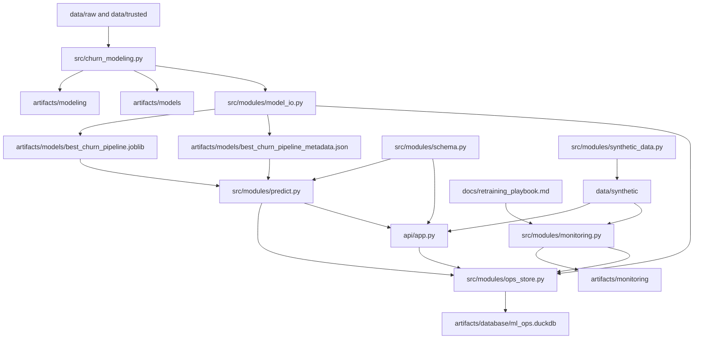

# Evolucao para um Fluxo de ML End-to-End

Este documento descreve a arquitetura alvo e o plano de implementacao da evolucao do projeto de churn para um fluxo mais proximo de producao. O foco e manter a solucao enxuta o suficiente para portfolio, mas com responsabilidades bem separadas, persistencia operacional e evidencias de system design.

Convencao adotada nesta arquitetura:

- arquivos em `src/` e `src/modules/` representam codigo-fonte
- arquivos em `artifacts/` representam saidas persistidas do pipeline, da inferencia e do monitoramento
- por isso, o modulo `src/modules/ops_store.py` gerencia o banco local, mas o banco efetivo fica em `artifacts/database/ml_ops.duckdb`

## Objetivo

Expandir o pipeline atual de modelagem para incluir:

- persistencia padronizada do pipeline vencedor
- inferencia reutilizavel fora do notebook
- validacao de schema e qualidade de entrada
- API de scoring com FastAPI
- dados sinteticos para teste da API
- monitoramento com simulacao de drift
- armazenamento operacional local em banco `.duckdb`
- documentacao do fluxo de retreinamento

## Arquitetura alvo

## Modulos e responsabilidades

### `src/churn_modeling.py`

- treina e compara os modelos
- identifica o pipeline vencedor
- gera artefatos analiticos
- chama a persistencia do melhor pipeline

### `src/modules/model_io.py`

- monta o bundle do modelo vencedor
- salva o pipeline serializado
- salva metadata operacional do artefato
- carrega artefatos para inferencia

### `src/modules/schema.py`

- valida colunas obrigatorias
- valida tipos numericos
- valida regras basicas de qualidade
- padroniza a entrada para inferencia

### `src/modules/predict.py`

- aplica validacao de schema
- executa feature engineering para inferencia
- alinha as colunas esperadas pelo pipeline
- gera score e classe prevista

### `src/modules/ops_store.py`

- inicializa o banco local DuckDB
- registra versoes de modelo
- grava logs de previsao
- persiste snapshots de monitoramento
- registra alertas de drift

### `src/modules/synthetic_data.py`

- gera dados sinteticos baseline
- gera dados sinteticos com drift
- salva datasets para demonstracao e testes de API

### `src/modules/monitoring.py`

- compara dados novos com a base de referencia
- calcula metricas de drift, como PSI
- gera snapshots e alertas
- salva artefatos de monitoramento

### `api/app.py`

- expoe o modelo por HTTP
- oferece endpoints de health, metadata e predicao
- registra o uso operacional no banco local

## Fases de implementacao

### Fase 1. Persistencia e registro do modelo

- criar `src/modules/model_io.py`
- integrar `save_best_model(...)` ao pipeline de treino
- registrar metadata do modelo no banco local

### Fase 2. Inferencia e validacao

- criar `src/modules/schema.py`
- criar `src/modules/predict.py`
- garantir inferencia consistente a partir de dados brutos

### Fase 3. Persistencia operacional local

- criar `src/modules/ops_store.py`
- inicializar `artifacts/database/ml_ops.duckdb`
- salvar logs de previsao, snapshots de monitoramento e alertas

### Fase 4. API

- criar `api/app.py` com FastAPI
- expor endpoints para inferencia unitaria e em lote
- integrar logs no banco local

### Fase 5. Dados sinteticos

- criar `src/modules/synthetic_data.py`
- gerar datasets baseline e driftado
- usar esses datasets para testar a API e o monitoramento

### Fase 6. Monitoramento

- criar `src/modules/monitoring.py`
- calcular drift por feature
- gerar alertas quando houver mudanca relevante

### Fase 7. Retreinamento

- nao implementar agora
- deixar o processo documentado para mostrar maturidade operacional

## Tabelas previstas no banco DuckDB

### `model_registry`

- `model_version`
- `model_name`
- `created_at_utc`
- `threshold`
- `bundle_path`
- `metadata_path`
- `metrics_json`

### `prediction_logs`

- `prediction_timestamp_utc`
- `request_id`
- `source`
- `model_name`
- `model_version`
- `score`
- `predicted_label`
- `threshold`

### `prediction_inputs_sample`

- `prediction_timestamp_utc`
- `request_id`
- `payload_json`

### `monitoring_snapshots`

- `run_id`
- `observed_at_utc`
- `dataset_label`
- `feature_name`
- `reference_mean`
- `current_mean`
- `reference_std`
- `current_std`
- `psi`
- `missing_rate`
- `drift_severity`

### `drift_alerts`

- `run_id`
- `alert_timestamp_utc`
- `feature_name`
- `psi`
- `severity`
- `message`
- `recommended_action`

## Cenario de drift para portfolio

Para a demonstracao de drift, o plano e gerar um dataset sintetico em que:

- `call_failure` aumenta
- `complains` aumenta
- `frequency_of_use` e `seconds_of_use` diminuem
- `customer_value` cai
- `charge_amount` sobe
- a distribuicao de `subscription_length` se desloca

Esse cenario deve provocar:

- mudanca nas distribuicoes de entrada
- aumento do risco previsto de churn
- alerta de drift no monitoramento

## Processo documentado de retreinamento

O retreinamento nao sera implementado agora, mas o fluxo esperado sera:

1. receber novo lote validado
2. rodar monitoramento contra a base de referencia
3. confirmar drift relevante ou degradacao do modelo
4. reexecutar o pipeline de treino com o novo conjunto
5. comparar o novo modelo com o atual em metricas e estabilidade
6. persistir uma nova versao se houver ganho ou recuperacao
7. atualizar o registro de modelos e a referencia de monitoramento

## Criterios de aceite

- o pipeline vencedor precisa ser salvo e recarregado com sucesso
- a inferencia precisa funcionar a partir dos dados brutos
- a API precisa responder para casos unitarios e em lote
- o banco local precisa registrar modelo, previsoes e monitoramento
- os dados sinteticos precisam acionar um alerta de drift no cenario planejado
